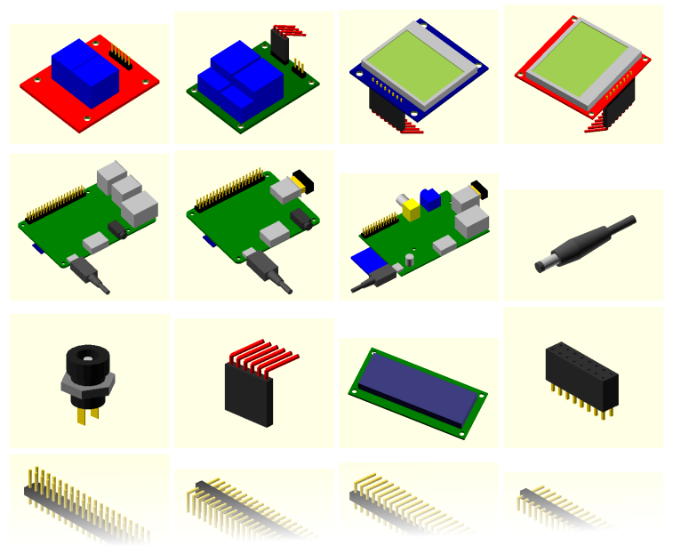

# OpenSCAD Raspberry Pi Library

OpenSCAD library of various objects to use in Raspberry Pi-based projects

This is a simple library of objects that I designed to assist 
myself in creating various projects based on the Raspberry Pi. 
The main goal is to have a realistic representation of the size 
of the overall assemble, to aid in building a suitable case for 
the projects. I used the same OpenSCAD software to design 
3D-printed or laser-cut cases.

See the **[img/README.md file](img/README.md)** for a gallery of snapshot images.

#### Raspberry Pi Boards

* Raspberry Pi Model B v.2
* Raspberry Pi Model A+ rev.1.1
* Raspberry Pi 3 Model B v.1.2

#### Components

* 1602A LCD panel 16x2 characters
* SainSmart Two-relays module
* Keyes Two-relays module
* PCD8544 LCD module, blue PCB, pins below
* PCD8544 LCD module, red PCB, pins above

#### Miscellaneous Parts

* Coaxial power plug 5.0 mm
* Coaxial power plug socket, with 2.1 mm pin
* Mini push button
* Matrix of 2.54 mm dupont female connectors
* Matrix of 2.54 mm female connectors
* Matrix of 2.54 mm pins
* Pin header, 2.54 mm, right angle, low profile
* Pin header, 2.54 mm, right angle, high profile
* USB male Type-A connector
* USB male Micro-B connector

#### Gadgets

* USB external hard disk 2.5" (Toshiba)
* UBS 2.0 hub 7 ports, Amazon Basics
* UBS 3.0 hub 4 ports, Amazon Basics (**WARNING**: does not work with the Raspberry Pi, VIA Labs chip, USB ID 2109:2811)
* UGREEN USB Audio Adapter
* Nano WiFi USB dongle by Edimax
